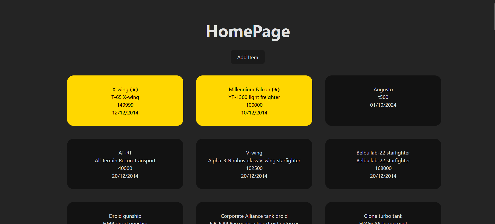
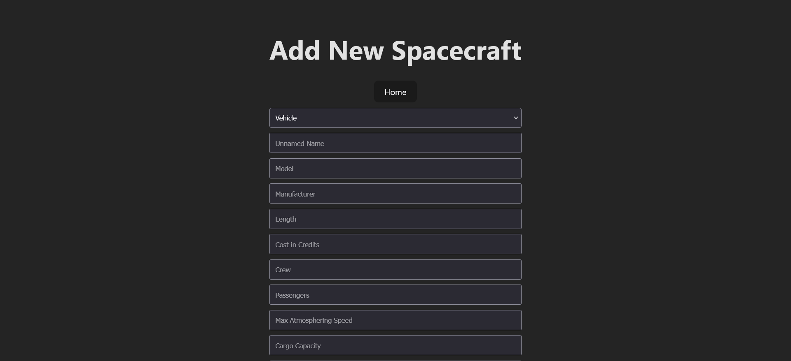

# Star Wars Garage

This is a simple React + TypeScript + Vite application to fetch vehicles from the Star Wars API.

## ❗️ Features
## 🖼️ Examples

## ⚒️ Technologies Used

- React
- Vite
- Typescript
- React Router

## ❕ Yet to implement
- ~~(IMPORTANT) Add filter to show all, only vehicles or only starships~~
- ~~Set local spacecrafts as favorite~~
- Currently the Homepage only shows the name of the spacecraft, the model, the cost in credits, the date created, and
if the spacecraft is marked as favorite. While all the other data is retrieved from the API, it's not currently shown.
Design a Card component to show all the data.
- Improve UI

## 📑 License
[MIT](http://opensource.org/licenses/MIT)

This project is licensed under the MIT License.

# Progetto FE

## Introduzione

Sono un appassionato di star wars che adora i veicoli e le astronavi ideate da Lucasfilm.

Conosco le api `SWAPI` che contengono sia veicoli che astronavi ma sono fermi da episodio 7.
Essendo un vero fan, anche delle loro ultime creazioni, mi piacerebbe inserire le astronavi e i veicoli mancanti.

Il millennium falcon e lo x-wing sono veramente iconiche devo per forza averle sempre in primo piano.

## Obiettivo

Creare un'applicazione in Vite+React+TypeScript che gestisca una lista di veicoli e astronavi di Star Wars, includendo i mezzi preferiti e la possibilità di aggiungere nuovi elementi. I dati saranno salvati localmente utilizzando il local storage.

## Funzionalità principali

### Lista unificata di astronavi e veicoli:

- Visualizzare una lista che includa sia i veicoli che le astronavi di Star Wars, recuperati dalle API di SWAPI;
- Aggiungere un filtro con chip per alternare tra veicoli e astronavi;
- I mezzi preferiti, come il Millennium Falcon e l'X-Wing, devono sempre apparire in cima alla lista.

### Pagina per aggiungere nuovi mezzi

- Creare una pagina dedicata all'inserimento di nuovi veicoli o astronavi, con i dati salvati in local storage;
- I nuovi mezzi aggiunti devono essere visibili nella lista principale insieme a quelli di SWAPI.

## Risorse

### Fondazionali

- [React](https://react.dev/);
- [Typescript](https://www.typescriptlang.org/);
- [Vite](https://vitejs.dev/).

### Progetto

- [SWAPI](https://swapi.dev/);
- [I veicoli di SWAPI](https://swapi.dev/documentation#vehicles);
- [Le astronavi di SWAPI](https://swapi.dev/documentation#starships).